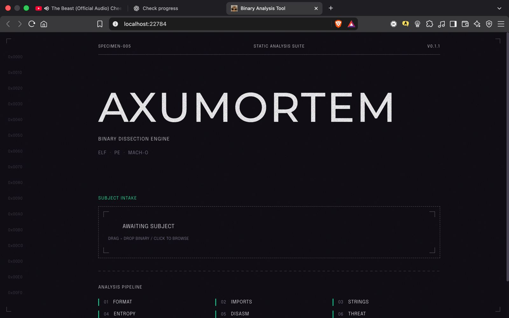

# AXUMORTEM

### Static Binary Analysis Engine for Malware Triage & Threat Intelligence

<p align="center">
  
</p>

<p align="center">
  <strong>Dissecting binaries without execution.</strong><br>
  ELF • PE • Mach-O • YARA • Entropy • Disassembly • MITRE ATT&CK
</p>

---

## Overview

AXUMORTEM is a modern static malware analysis platform built for malware analysts, incident responders, reverse engineers, and cybersecurity researchers.

The platform performs deep static analysis on executable files without executing them, enabling safe malware triage and rapid threat assessment.

---

## Dashboard Preview

### Features Visible in the Interface

- Drag-and-drop binary upload
- Multi-format executable support
- Automated analysis pipeline
- Threat scoring engine
- Static disassembly workflow
- Entropy detection
- String extraction
- MITRE ATT&CK mapping

---

## Core Capabilities

### Cross-Platform Binary Parsing

Supports:

- Windows PE
- Linux ELF
- macOS Mach-O

Extracts:

- Headers
- Sections
- Imports
- Exports
- Symbols
- Entry points
- Metadata

---

### YARA Signature Scanning

Detects:

- Malware families
- Ransomware indicators
- Loaders
- Trojans
- Suspicious artifacts

Example:

```yara
rule Suspicious_Powershell
{
    strings:
        $ps = "powershell.exe"

    condition:
        $ps
}
```

---

### Disassembly Analysis

Provides:

- Function discovery
- Control flow inspection
- API call analysis
- Assembly instruction review
- Suspicious opcode detection

Useful for identifying:

- Persistence mechanisms
- Process injection
- Credential theft
- Network behavior

---

### String Extraction

Extracts:

- ASCII strings
- UTF-8 strings
- Unicode strings

Examples:

```text
powershell.exe
cmd.exe
CreateRemoteThread
VirtualAllocEx
```

---

### Entropy Analysis

Detects:

- Packed executables
- Encrypted payloads
- Obfuscation techniques

| Entropy | Interpretation |
|----------|---------------|
| 0-4 | Normal |
| 4-6 | Moderate |
| 6-8 | Suspicious |
| >7.5 | Likely Packed/Encrypted |

---

### MITRE ATT&CK Mapping

Maps indicators to ATT&CK techniques.

Examples:

| Indicator | Technique |
|------------|-----------|
| PowerShell Execution | T1059.001 |
| Process Injection | T1055 |
| Credential Dumping | T1003 |
| Registry Persistence | T1547 |

---

## System Architecture

```text
Frontend (Next.js)
        │
        ▼
Backend API (Rust + Axum)
        │
 ┌──────┼──────┐
 ▼      ▼      ▼
Parser YARA Disassembler
        │
        ▼
 Analysis Engine
        │
        ▼
 PostgreSQL
        │
        ▼
 Threat Scoring
```

---

## Analysis Workflow

### 1. Upload Binary

```text
sample.exe
sample.elf
sample.macho
```

### 2. Identify Format

- Architecture detection
- Metadata extraction
- Binary classification

### 3. Static Extraction

- Imports
- Exports
- Sections
- Strings

### 4. YARA Scan

- Signature matching
- Threat indicators

### 5. Entropy Analysis

- Packing detection
- Encryption detection

### 6. Disassembly

- Assembly generation
- Function analysis

### 7. Threat Scoring

- MITRE ATT&CK mapping
- Risk classification

### 8. Results Dashboard

- Overview
- Strings
- Imports
- Entropy
- YARA hits
- Threat score

---

## Technology Stack

### Backend

- Rust
- Axum
- Tokio
- SQLx
- PostgreSQL
- Serde
- YARA

### Frontend

- Next.js
- TypeScript
- React
- Tailwind CSS

### Infrastructure

- Docker
- Docker Compose
- PostgreSQL

---

## Project Structure

```text
Binary-Analysis-Tool
│
├── backend/
├── frontend/
├── infra/
├── assets/
│   └── axumortem-ui.jpg
│
├── compose.yml
├── dev.compose.yml
├── justfile
└── README.md
```

---

## Local Setup

Clone:

```bash
git clone https://github.com/deepanshukuntal787-rgb/Binary-Analysis-Tool.git
cd Binary-Analysis-Tool
```

Start:

```bash
docker compose up -d
```

Open:

```text
http://localhost:22784
```

Stop:

```bash
docker compose down
```

---

## Future Enhancements

- Dynamic sandbox analysis
- IOC extraction
- VirusTotal integration
- Sigma correlation
- AI-powered classification
- Threat intelligence enrichment
- Attack graph visualization

---

## Security Notice

AXUMORTEM performs static analysis only.

Always handle malware samples inside isolated environments.

---

## License

MIT License

---

<p align="center">
Built for Reverse Engineers, Malware Analysts, and Security Researchers.
</p>